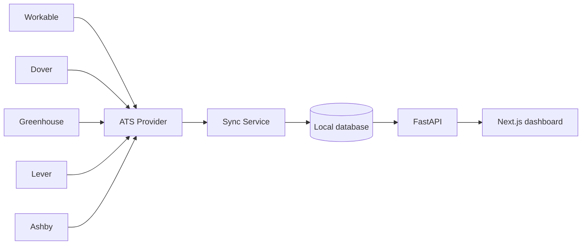
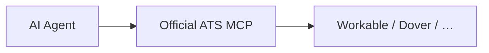

# ATS Mirror

One recruiting data layer. Any ATS.

ATS Mirror is a self-hosted recruiting data layer that synchronizes and
normalizes data from multiple Applicant Tracking Systems into one local
database for analytics, search, history, exports, and cross-ATS workflows.

It is **not** a replacement for Workable, Dover, Greenhouse, or any other ATS.
The ATS remains the operational system of record.

## Why

Recruiting data often becomes fragmented when companies:

- change ATS
- use multiple ATS platforms
- need historical analytics
- want cross-ATS candidate search
- want a local data layer for AI/analytics
- do not want to replace their existing ATS

## Architecture



Separate from this product:



Official MCP integrations can move candidates, add notes, and perform other
interactive ATS actions. ATS Mirror only **mirrors** ATS data: normalize it,
preserve history, make it searchable, enable analytics, and eventually combine
data from multiple ATS platforms.

Dashboard pages query the **local SQLite copy**. They do not call the ATS on
every page load. **Sync changes** (`POST /api/sync/incremental`) is the ordinary
action. **Full sync** (`POST /api/sync`) re-reads every supported collection.

## Supported providers

| Provider | Status |
|---|---|
| Mock | Available |
| Workable | Read-only SPI v3 mirror (live account token required) |
| Dover | Planned |
| Greenhouse | Planned |
| Lever | Planned |
| Ashby | Planned |

## No LLM required

ATS Mirror does not require OpenAI, Claude, Gemini, Grok, or other LLM API credits.

Set `AI_ENABLED=false`. There is no AI provider in this product.

## Quick start (mock)

Requires Python 3.12 and Node.js 20+.

```powershell
copy .env.example .env
# ATS_PROVIDER=mock and DRY_RUN=true are already set

cd backend
python -m venv .venv
.\.venv\Scripts\activate
pip install -e ".[dev]"
uvicorn app.main:app --reload --port 8000
```

```powershell
cd frontend
copy .env.example .env.local
npm install
npm run dev
```

Open http://localhost:3000 and press **Sync changes**. Jobs and candidates then
come from SQLite. Normalized candidates can be exported as CSV from /candidates.

API: http://127.0.0.1:8000  
Docs: http://127.0.0.1:8000/docs

## Workable (read-only)

Official Recruiter API (SPI v3). Authentication is an **account API token**
sent as `Authorization: Bearer <token>`.

1. In Workable: **Integrations → Apps → Generate API token**.
2. Grant read scopes `r_jobs` and `r_candidates`.
3. Copy the account subdomain from company profile settings.
4. Put values only in server-side `.env` (never in frontend code):

```
ATS_PROVIDER=workable
WORKABLE_SUBDOMAIN=your-subdomain
WORKABLE_ACCESS_TOKEN=your-token
```

Token setup is documented at https://workable.readme.io/reference/generate-an-access-token

Sync writes **only** to ATS Mirror's local database. This experiment implements
**no Workable write operations**. `DRY_RUN=true` can stay on; local mirroring
is not an ATS write.

Field-level mapping: [Workable mapping](docs/WORKABLE_MAPPING.md). Incremental
filters and watermarks: [Workable incremental sync](docs/WORKABLE_INCREMENTAL_SYNC.md).

Binary resumes are **not** downloaded. File metadata (name, type, source) may
be mirrored. Workable file URLs are temporary and are not treated as permanent.
Set `DOWNLOAD_ATTACHMENTS=false` (default). Full attachment archival is disabled.

## Tests

```powershell
cd backend
pytest
mypy app
ruff check app tests
```

```powershell
cd frontend
npm run lint
npm run typecheck
npm run build
```

No automated test calls a real ATS. No Workable token is required for CI.

## Configuration

See `.env.example`. Secrets stay server-side.

## Docs

- [Architecture](docs/ARCHITECTURE.md)
- [Workable mapping](docs/WORKABLE_MAPPING.md)
- [Workable incremental sync](docs/WORKABLE_INCREMENTAL_SYNC.md)
- [Adding an ATS](docs/ADDING_AN_ATS.md)
- [Security](docs/SECURITY.md)
